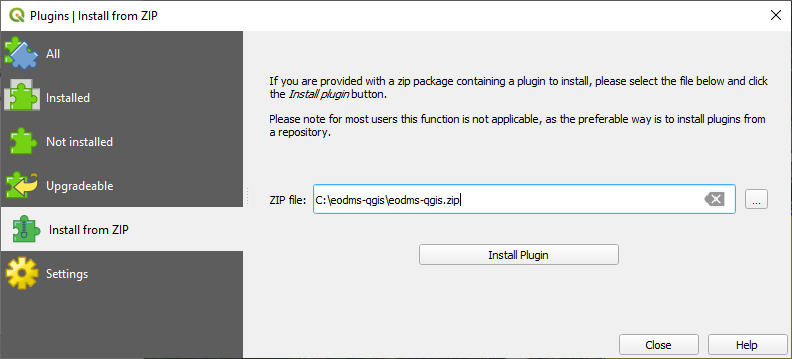
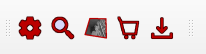

EODMS QGIS Plugin
=================

- [Installation](#Installation)
- [Documentation](#documentation)

This Readme contains a quick guide to installing the EODMS plugin in QGIS.

> **_NOTE:_** QGIS must be using Python 3.8 or higher to run this plugin. You can check the Python version by opening the Python console <kbd></kbd> and entering: 
> 
> ```python
> >>> import sys
> >>> sys.version
> '3.9.5 (tags/v3.9.5:0a7dcbd, May  3 2021, 17:27:52) [MSC v.1928 64 bit (AMD64)]'
> ```

## Download ZIP from Github

You can download the plugin as a .zip file by:

- Selecting **Download ZIP** from the **<> Code** drop-down

	<br>
    *Select Download ZIP from Code dropdown*

or

- Using this link https://github.com/eodms-sgdot/eodms-qgis/archive/refs/heads/main.zip

## Installation

### Zip Plugin Folder and Install in QGIS

Using an application like 7zip, zip the entire **eodms-qgis** plugin folder.

In QGIS:

1. Under the menu item **Plugins**, select **Manage and Install Plugins...**
2. In the side panel, click **Install from ZIP**.
3. Click the browse button <kbd></kbd> and select the zip file.

    <br>
    *The **Install from ZIP** window of the Manage and Install Plugins feature*

4. Click **Install Plugin**.

### Initialize the Plugin in QGIS

Follow these instructions to initialize the plugin in QGIS:

1. Under the menu item **Plugins**, select **Manage and Install Plugins...**
2. In the Plugins dialog, locate and check the **EODMS** plugin from the list.

	<br>
    *List of plugins with the EODMS highlighted*

3. Click **Close** to exit the Plugins dialog.
4. If the following buttons appear on the toolbar, the plugin is ready to be used.

	

## Documentation

For more in-depth instructions on using the plugin, open the [eodms-plugin-documentation.md](docs/eodms-plugin-documentation.md) or [EODMS_Plugin_Documentation.pdf](docs/EODMS_Plugin_Documentation.pdf) located in the ```docs``` folder.
