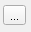

EODMS Plugin Digitization Documentation
=====================================

<!-- TOC -->

## QGIS INSTALLATION

The installation files for QGIS can be found at https://qgis.org/en/site/forusers/download.html. It is best to install one of the standalone installers.

**NOTE**: An administration account is required to install QGIS on government computers.

For this documentation, it is assumed you have some knowledge of using QGIS, such as loading layers, drawing features, adding symbology including labels and manipulating the map view.

## NAPL Generator Plugin Installation

### Zip Plugin Folder and Install in QGIS

Using an application like 7zip, zip the entire **eodms-qgis** plugin folder.

In QGIS:

1. Under the menu item **Plugins**, select **Manage and Install Plugins...**
2. In the side panel, click **Install from ZIP**.
3. Click the browse button <kbd></kbd> and select the zip file.

     
    *The **Install from ZIP** window of the Manage and Install Plugins feature*

4. Click **Install Plugin**.

### Initialize the Plugin in QGIS

Follow these instructions to initialize the plugin in QGIS:

1. Under the menu item **Plugins**, select **Manage and Install Plugins...**
2. In the Plugins dialog, locate and check the **EODMS** plugin from the list.

	 
    *List of plugins with the EODMS highlighted*

3. Click **Close** to exit the Plugins dialog.
4. If the following buttons appear on the toolbar, the plugin is ready to be used.
	
	

## EODMS Plugin Overview

### Tools

The tools provided in the EODMS plugin are as follows:

|                        Tool Name                         |                            Button                             |                                      Description                                            |
|----------------------------------------------------------|---------------------------------------------------------------|---------------------------------------------------------------------------------------------|
| [Settings](#settings)                                    | <kbd></kbd>   | Opens the Settings dialog providing ways to configure username, password and other options. |
| [Submit a Search](#submit-search)                        | <kbd></kbd>       | Opens the Search dialog to submit a search to the RAPI with filters and search parameters.  |
| [Show Thumbails of Results](#show-thumbnails-of-results) | <kbd></kbd> | Loads the thumbnails of the selected image footprints.                                      |
| [Submit Orders](#submit-orders)                          | <kbd></kbd>         | Opens the Order dialog to submit the orders for the selected images.                        |
| [Download Available Images](#download-available-images)  | <kbd></kbd>   | Opens the Download dialog which lists the current orders in a user's account.               |

## Settings

 
*The Settings Dialog*

| Parameter          | Description                                                      |
|--------------------|------------------------------------------------------------------|
| Username           | The username of an EODMS account.                                |
| Password           | The password of the EODMS account.                               |
| Log path           | The path where the log output from the EODMS RAPI will be saved. |
| RAPI attempts      | The number of attempts made to the EODMS RAPI before cancelling. |
| RAPI query timeout | The total timeout time, in seconds, for queries to the RAPI.     |
| RAPI order timeout | The total timeout time, in seconds, for orders sent to the RAPI. There is a separate timeout option for orders since the time to get orders can take quite a while depending on the number of orders for the user. |

## Submit Search

1. Before submitting a search, select a feature on the QGIS map to apply a spatial filter to the search.

	> **_NOTE:_**  The projection of the layer must be in WGS84 for the search to work.

	

2. Click the Search button to open the Search dialog.

	
	
3. If there are any previous searches, you can select one from the **Previous 10 Searches**.

	

4. To get a list of collections, click the <kbd></kbd> button. Once the list has loaded, select which collections you would like to include in your search.

	
	
5. Enter the ***Maximum Results per Collection***.

	
	
6. Click the <kbd></kbd> button to get a set of filters for each collection. Unders the **Filters** section, a tab for each collection will appear. Enter the filter values for your search.

	
	
7. For dates, you can choose either to enter:

	- a date range
	
		
	
	- a date interval
	
		
		
8. Depending which date, click either <kbd></kbd> or <kbd></kbd> to add the dates to the list.

	

9. Once all the values have been enter, click <kbd></kbd> to submit your search.

10. When the search is complete, the results will be placed in a layer called ***EODMS RAPI Results***.

	

## Show Thumbnails of Results

You can load thumbnails over the footprints of the search results.

1. Select the footprints for which you would like to load

	
	
2. Click the Thumbnail button <kbd></kbd>

	

## Submit Orders

To submit orders to the EODMS:

1. Select a set of image footprints from the map.

	

2. Click the EODMS Order button <kbd></kbd>.

	
	
3. The images you selected will appear in the **Images** list. Select the **Priority Level** for the order.

4. Click <kbd></kbd> to submit your order.

## Download Available Images

1. Open the Downloader dialog by clicking the EODMS Download button <kbd></kbd>.

	

2. Enter a **Download Path** by clicking the ***Browse*** button.

	

3. Select the images you would like to download from the list of order items (you can only download images with status "Product is available for download.").

	
	
4. You can refresh the order item list to see if your order is ready by clicking the refresh button <kbd></kbd>.

5. Once the download process is complete, the image files should be available in download path you specified.

	